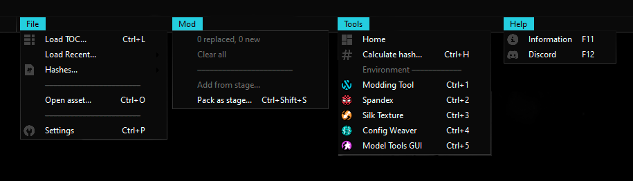

# WebWorks - Guide
## Menus

### File
| Command            | Shortcut           | Function                                                                   |
| ------------------ | ------------------ | -------------------------------------------------------------------------- |
| **Load TOC...**    | `Ctrl + L`         | Loads the Table of Contents (TOC) and sets up the environment for modding. |
| **Load Recent...** | `Ctrl + Shift + T` | Saves and displays the 5 most recent TOC paths for quick access.           |
| **Hashes...**      | -                  | Allows selection of a hashes file to use when loading the TOC.             |
| **Open asset...**  | `Ctrl + O`         | Opens an asset and its corresponding tool (e.g., Spandex, Silk Texture).   |
| **Settings**       | `Ctrl + P`         | Opens the settings window. Refer to [Settings](#settings) for details.     |

### Mod
| Command               | Shortcut           | Function                                                                                              |
| --------------------- | ------------------ | ----------------------------------------------------------------------------------------------------- |
| **Add from stage...** | -                  | Adds asset files found in specified stage within the `/stages` folder located next to `WebWorks.exe`. |
| **Pack as .stage...** | `Ctrl + Shift + S` | Opens the "Pack as .stage" window to bundle replaced and added assets into a `.stage` file.           |

### Tools
| Command               | Shortcut   | Function                                                                 |
| --------------------- | ---------- | ------------------------------------------------------------------------ |
| **Home**              | -          | Displays the home wallpaper.                                             |
| **Calculate hash...** | `Ctrl + H` | Opens the hash tool to calculate CRC-32 or CRC-64 for any input string.  |
| **Modding Tool**      | `Ctrl + 1` | Displays the modding environment.                                        |
| **Spandex**           | `Ctrl + 2` | Opens [Spandex](Soandex.md) (material editor) within WebWorks.           |
| **Silk Texture**      | `Ctrl + 3` | Opens [Silk Texture](SilkTexture.md) (texture editor) within WebWorks.   |
| **Config Weaver**     | `Ctrl + 4` | Opens [Config Weaver](ConfigWeaver.md) (config editor) within WebWorks.  |
| **Model Tools GUI**   | `Ctrl + 5` | Opens [Model Tools GUI](ModelToolsGUI.md) (model tools) within WebWorks. |

### Help
| Command         | Shortcut | Function                                                               |
| --------------- | -------- | ---------------------------------------------------------------------- |
| **Information** | `F11`    | Opens the information window, which contains links to the GitHub page. |
| **Discord**     | `F12`    | Opens the official Discord server: [Discord](https://discord.com).     |