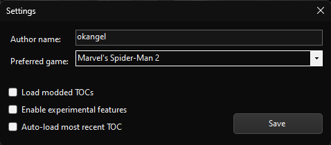

# WebWorks Settings

WebWorks contains various settings you can modify to customize your experience. To open the settings window, click **Settings** under **File**, or simply press `Ctrl + P`. Below is an overview of what each setting does:

- **Author name & Preferred game**:  
  Sets the base author name and game. They will be automatically filled in each time you open the "Pack as .stage..." window.

- **Load modded TOCs**:  
  - If **disabled**, the tool will look for `toc.BAK` in the same directory by default when loading a TOC.
  - If **enabled**, it will default to the input path provided.

- **Enable experimental features**:  
  Enables experimental tools and features. For more details, refer to [Tool Experiments](Tool_Experiments.md).

- **Auto-load most recent TOC**:
  - If **enabled**, the tool will automaticlly load the most recent TOC the user had opened. Paths to TOCs are stored in `settings.json`
  - You can alternatively load the most recent TOC with the keyoard shortcut `Ctrl + Shift + T` or by selecting it under **File > Load Recent...**

