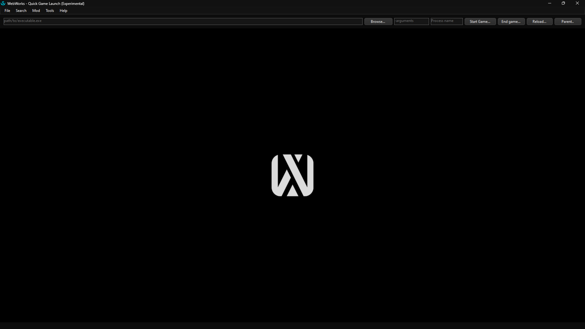

# Tool Experiments
To enable experiments, open the settings window under **File > Settings** or press `Ctrl + P` and check **Enable experimental features**. Afterwards, click **Save** to save your settings. For more info related to settings, refer to [WebWorks Settings](Settings_Guide.md).

Next time you open WebWorks again, you'll notice the available experiments take place. Here's the list of current experiments:

---

### Quick Game Launch

This tool is designed to allow users to quickly debug and launch a game directly within WebWorks. It works by running the specified executable with the arguments provided in one of the textboxes. The tool then uses the **Process name** to parent the game process to the panel. This tool will likely be deprecated in the future.  

**Note:** This is an extremely experimental feature and should be used with caution.

Below is a brief overview of what each button does:

- **Start Game...**:  
  Starts the game process and automatically attempts to parent its window to WebWorks.

- **End game...**:  
  Ends all running instances of the game process.

- **Reload...**:  
  Stops the current game process and re-launches it.

- **Parent**:  
  Attempts to parent the game window to WebWorks in case **Start Game** failed to so. It uses the name specified in the **Process name** field to identify the correct window.

### Example Usage

- **Executable Path**: `C:/path/to/spiderman.exe`  
- **Arguments**: `-nolauncher`  
- **Process Name**: `Spider-Man`  

This configuration will launch the game `Spider-Man` without the launcher (`-nolauncher` argument) and attempt to parent its window to WebWorks using the process name `Spider-Man`.

