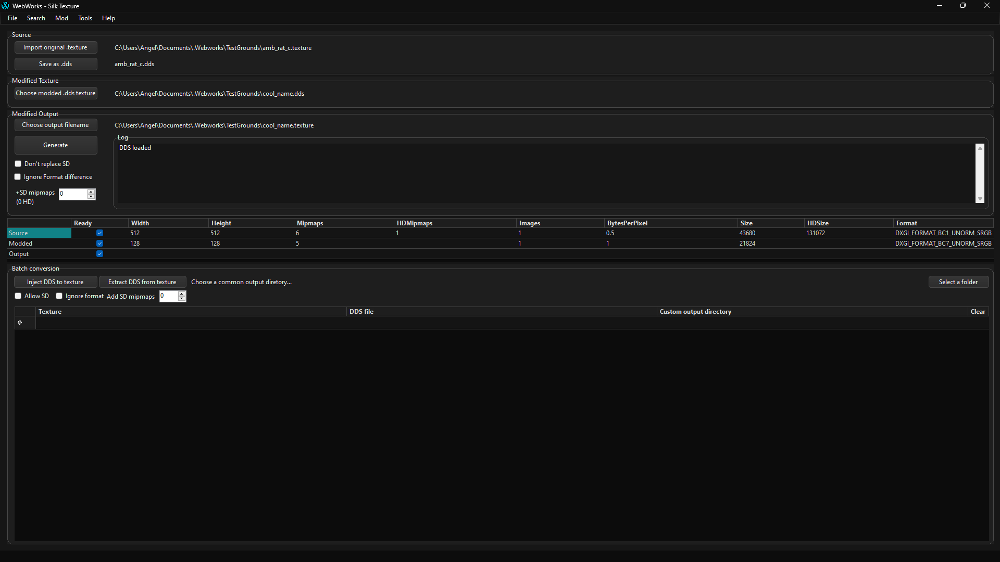

#  Silk Texture
## About
Silk Texture is a texture conversion tool designed to let modders convert `.texture` and  `.dds` formats, and optionally scaling game textures to higher qualities (4K to 8K).

Supported games:
- Marvel's Spider-Man Remastered
- Marvel's Spider-Man: Miles Morales
- Marvel's Spider-Man 2
- Ratchet & Clank: Rift Apart

## Getting Started
### Modding Textures

Below are a set of steps to help you get started modding `.texture` files.

1. **Extract Low-Resolution Texture Asset**  
   - Use the [Modding Tool](ModdingTool.md) to extract the low-resolution texture asset (`.texture` file).
2. **Load Texture in Silk Texture**  
   - Launch **Silk Texture** under **Tools > Silk Texture** or by running it as a separate executable.  
   - Click the **first button** to load the extracted `.texture` file.  
   - The grid at the bottom will display the dimensions, DXGI format, and size of the high-resolution piece (`HDSize`).  
   - If `HDSize` is `0`, it's a single-part texture, and you can skip the HD steps below.
3. **Extract High-Resolution Texture**  
   - In the Modding Tool, locate the high-resolution part.  
   - Verify that the file size (`HDSize`) matches the value shown in Silk Texture.  
   - Extract and save it with the **exact same name** but with a `.hd.texture` extension.
4. **Save Texture as `.DDS`**  
   - Back in Silk Texture, click the **second button** to save the texture as a `.DDS` file.  
   - The filename and location are chosen automatically.  
   - If Silk Texture complains about not finding the HD part, cancel and double-check your filenames.
5. **Edit and Scale Texture**  
   - Open the `.DDS` file in your image editor and scale it up to 4K.  
   - Mark the texture in a noticeable way (e.g., a large mark visible from afar and a tiny detail requiring higher resolution).  
   - Resave it as `.DDS`, ensuring the compression format matches the one shown in Silk Texture.
6. **Import Modified `.DDS` Texture**  
   - Click the **third button** in Silk Texture to import your modified `.DDS` texture.  
   - Watch for errors in the **Log** section and compare the image attributes at the bottom of the window.  
   - Resave and reimport the file until the **Format** and **BytesPerPixel** match.
7. **Generate Output `.texture` Files**  
   - Click the **fourth button** to choose an output `.texture` filename.  
   - Use a friendly/short name that's easy to distinguish from the original.  
   - Two files will be generated for HD textures: `<name>.texture` and `<name>.hd.texture`.
8. **Enable Test Mode**  
   - Check the **Test** box ("don't replace SD mipmaps").  
   - This allows you to see the game transition between low and high-resolution textures.
9. **Generate and Verify**  
   - Click **Generate** and watch the **Log** section for a success message.  
   - In the Modding Tool, replace both the low and high-resolution textures with the new `.texture` and `.hd.texture` files.

### Batch Conversion
Silk Texture also has a menu for batch conversion at the bottom of the program, paste in the paths of your `.texture` file and their corresponding `.dds` file. You can set an output directory for files, or set it individually. Make sure there's always an empty row at the end to avoid certain issues. A workaround to this and JSON support is being worked on.

---

## Optional Settings

### Add SD Mipmaps (`--extrasd`)  
   - Moves mipmaps from the HD part to the SD part, effectively increasing the base resolution of the texture.  
   - No practical change in the game, as maximum texture sizes are capped by the texture quality setting (Low = 1K, Medium = 2K, etc.).  
   - Fixes low-res texture issues in some custom models where the game fails to load the HD part.  
   - To fix an affected texture:  
     - Export with this setting increased to the maximum.  
     - Move all data into the `.texture` file, leaving `.hd.texture` empty (size `0`).  
     - You do not need to replace the HD texture in your mod.

### Ignore Format Differences (`--ignoreformat`)
   - Silently ignores differences in DXGI format as long as the **BytesPerPixel** match.  
   - Use this if you're certain the format is correct, but your export software sets the option wrong in the file header.

### Test Mode (`--testmode`)  
   - Retains the original SD mipmaps while including your modified HD mipmaps.  
   - Use this to see the game transition between SD and HD mipmaps.