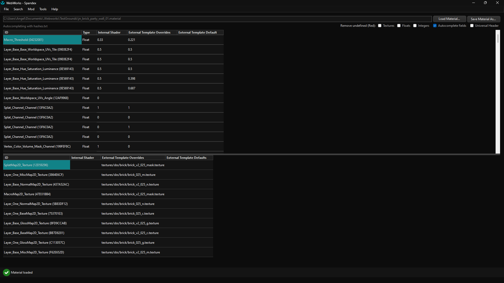

#  Spandex
## About
Material file editor for Marvel's Spider-Man Remastered, Marvel's Spider-Man Miles Morales and Marvel's Spider-Man 2 for PC.

Updated with new IDs, support for all materials (RCRA, MSMR, MSMM & MSM2), enhanced modern dark theme.

- Originally developed by hypermorphicmods, Nexus Mod Page: [Nexus Mods](https://www.nexusmods.com/marvelsspidermanremastered/mods/4395?tab=files)
- Also modified by Blake Young.

Supported games:
- Marvel's Spider-Man Remastered
- Marvel's Spider-Man: Miles Morales
- Marvel's Spider-Man 2
- Ratchet & Clank: Rift Apart

## Getting Started
### Loading a .material

Click **Load Material** to start loading the material. If everything goes through correctly you should see the material's numeric and string inputs on the top and bottom panels.
You can resize these panels by positioning your cursor very slightly above the bottom panel.

### Options
- **Remove undefined (Red)**:  
  Removes undefined values, both from numeric and string inputs.
- **Autocomplete fields**:  
  When editing an external template override string, it'll open a search box that'll let you select any texture in hashes.txt.
- **Universal header**:  
  This is an option for MSM2 files to replace the header with an universally compatible one, as of now, it's still experimental and may cause issues.

### Why is Spandex showing errors when loading certain materials?
Ensure that you’re using supported material types (RCRA, MSMR, MSMM, and MSM2). If errors persist, confirm that the file isn't corrupted and matches the game's original structure. If the material looks correct, it may not be compatible yet.