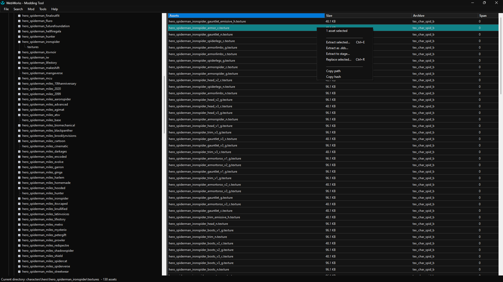
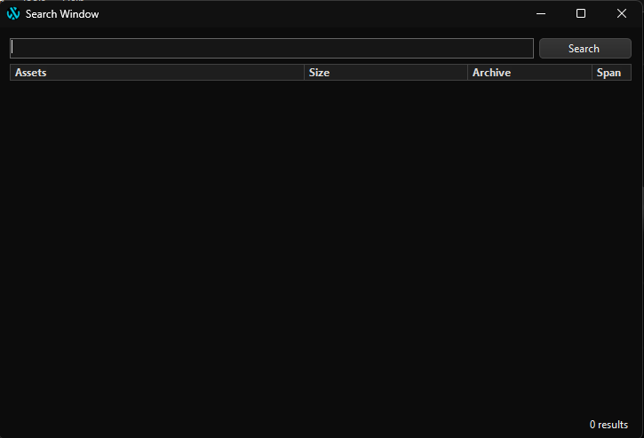
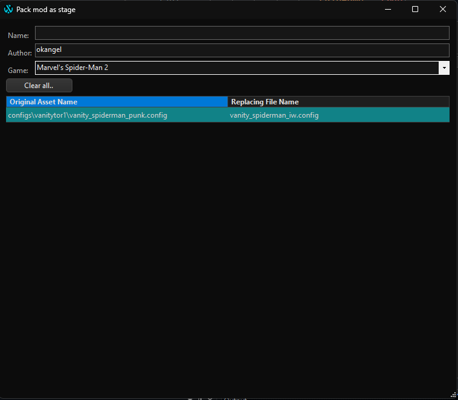

# WebWorks - Modding Tool
## About
WebWork's built-in Modding Tool allows you to view, extract and replace game assets. Packs mods to .stage format, compatible with [Overstrike](https://github.com/Tkachov/Overstrike/).

Supported games:
- Marvel's Spider-Man Remastered
- Marvel's Spider-Man: Miles Morales
- Marvel's Spider-Man 2
- Ratchet & Clank: Rift Apart

## Getting Started
### Loading a TOC file

Use **File > Load TOC** or keyboard shortcut **Ctrl + L** to start loading a TOC file. You can also use **File > Hashes...** to pick a hashes.txt file to use. Only files with "hashes.txt" and "hashes_" in their names will be displayed (Example: hashes_i30.txt).

On the left side of the interface, a folder tree is displayed, allowing users to navigate through the directory structure. When a folder is selected, the corresponding assets within that folder are shown on the right side.

Assets that do not have an associated name in the "hashes.txt" file are grouped under the **[UNKNOWN]** section, organized by their respective archive files. Similarly, audio assets with the .wem extension are grouped under the **[WEM]** section.

Right click an asset in the table to open the context menu or use one of the available keyboard shortcuts. Options are the following:

- **Extract selected... (Ctrl + E)** - Extract all selected assets from the table to a desired location.
- **Extract as .ascii... (model)** - Extract .model and automatically convert to .ascii.
- **Extract as .dds (texture)** - Extract .texture and automatically convert to .dds.
- **Extract to .stage...** - Extract asset and save to stages folder
- **Replace selected... (Ctrl + R)** - Replace asset and add it to the replaced assets list.
- **Copy path** - Copy full asset path.
- **Copy hash** - Copy asset hash.

---

### Search and Jump to Path

Press **Ctrl + S** or go to **Search > Search...** to open the search window. Use keywords separated by a space to find the asset you're looking for. Double click an asset to locate it in the main window.

Alternatively, you can use **Search > Jump to path or ref...** to quickly open a folder where a specific asset is.

---

### Packing as .stage

When you replace an asset with a file, the change is not applied instantly. Instead, you can view a list of all replaced assets (along with the disk files used for replacement) by navigating to **Mod > Pack as .stage...**.

In this menu, you can:
- Select the game your mod is intended for.
- Specify your name and the name of your mod.
- Remove replacements by selecting them and pressing the **Delete** key.
- Save the mod as a .stage file by clicking Pack as .stage.

For further customization like automatic author name and preffered game, go to **File > Settings** or press **Ctrl + P**.

---

### Stages
In addition to extracting and replacing assets individually, the tool provides options to extract to stage and replace from stage. A "stage" refers to a subfolder within the stages/ directory, located next to **WebWorks.exe**. Assets in a stage follow the original folder structure of the game and are organized by spans.

For example, if your stage is named test, an asset located at `characters\hero\hero_spiderman\hero_spiderman_body.model` from span 0 would be extracted to:
`stages/test/0/characters/hero/hero_spiderman/hero_spiderman_body.model`.

You can also build paths manually to add new assets to the game.

**Workflow Using Stages:**
- **Extract to Stage:** Extract all the assets you need into a stage.
- **Modify Files:** Make your desired changes to the files within the stage.
- **Replace from Stage:** Replace all the assets at once using the modified files from the stage, rather than replacing them one by one.